<div align="center">

# SEMA

***σῆμα*** &nbsp;·&nbsp; *the sign*

**The whole of an EEG recording on one screen, over [MNE-Python](https://mne.tools/).**

Every click is a real MNE call. Every call is recorded. The session you end up
with exports as a script that reproduces it.

Open source · runs on your own machine · no MATLAB licence

[](https://github.com/A12N4V/sema/actions/workflows/check.yml)

</div>

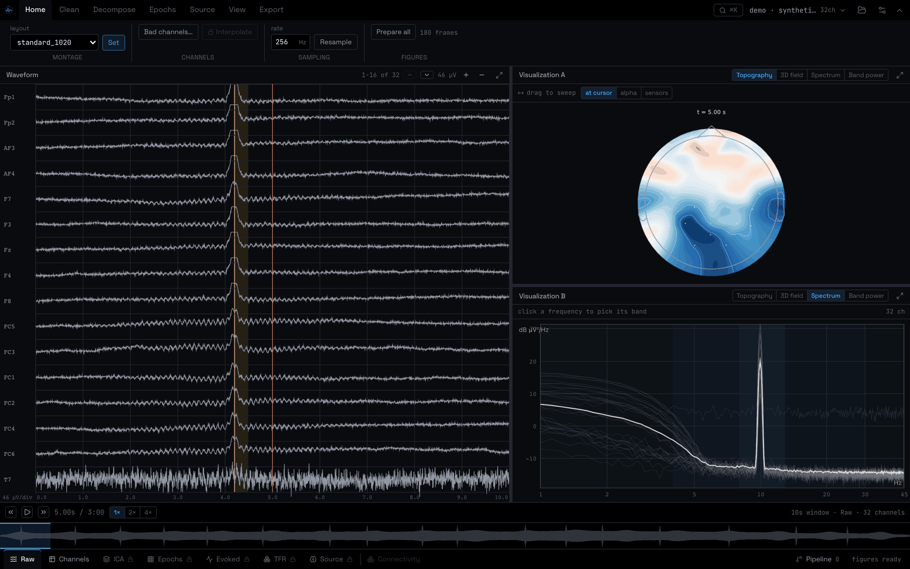

---

## What this is

Most people who analyse EEG do it one of two ways. They open EEGLAB in MATLAB
and click through a GUI that is excellent and twenty years old, or they write
MNE-Python scripts and rediscover the same twelve lines on every dataset. The
first path costs a licence and leaves you with a click history nobody can
rerun. The second gives you reproducibility and takes away the ability to just
*look* at the thing.

Sema is the third option. It is a browser workbench over MNE where the clicking
and the script are the same object: a branching provenance ledger that every
operation writes to, and that exports as a runnable `pipeline.py`.

Nothing here reimplements signal processing. MNE does all of it. This is the
surface.

<sub>**On the name.** σῆμα is Greek for *sign, mark, signal*, and the root of
semiotics, semantics and semaphore. In Peirce's terms an EEG trace is an
**index**: a sign physically caused by the thing it stands for, the way smoke is
caused by fire rather than agreed to mean it. A topographic map is an **icon**:
it stands for its object by resembling it. Turning the first into the second,
without losing the record of how, is the entire job of this program.</sub>

---

## Install

You need **Node 20+**. You do not need Python installed: `uv` fetches the right
interpreter itself.

```bash
git clone https://github.com/A12N4V/sema.git
cd sema
./scripts/setup.sh
```

That installs [`uv`](https://docs.astral.sh/uv/) if it is missing, builds
`backend/.venv` against CPython 3.11 (pinned, because MNE's dependency chain is
not solid on 3.13+), installs the frontend, and smoke-tests that MNE loads. It
is safe to re-run.

Then:

```bash
./dev.sh
```

Open **http://localhost:5173**. API docs are at `http://localhost:8123/docs`.

<details>
<summary>Doing it by hand</summary>

```bash
cd backend && uv sync --group dev
cd ../frontend && npm install
```

```bash
# two shells
cd backend  && ./.venv/bin/uvicorn app.main:app --reload --port 8123
cd frontend && npm run dev
```

Vite proxies `/api` to the backend, so the frontend only ever uses relative
URLs. Override the target with `SEMA_API_URL`.

</details>

---

## Five minutes with it

### 1. Get a recording in

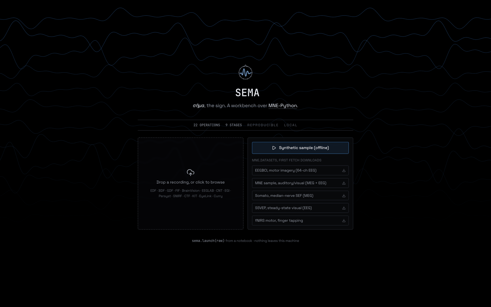

Click **Synthetic sample** and you have a 32-channel, 3-minute recording without
downloading anything. Or drop a file: EDF, BDF, GDF, FIF, BrainVision, EEGLAB
`.set`, CNT, EGI, Persyst, SNIRF, CTF, KIT, EyeLink, Curry. Or pull one of the
`mne.datasets` from the launcher. Or, from a notebook you already have open:

```python
import sema
sema.launch(raw)          # opens a browser on the Raw you are holding
```

While the recording loads, two things happen before the workbench opens. A
default chain runs on a filtered copy, so ICA, Epochs, Evoked, TFR and the
source estimate are already computed and the workspaces open with a figure in
them rather than a form. Then the server renders **every topography in the whole
file** into a disk cache. That is the pass the status bar calls *preparing*, and
it is why the next step feels the way it does.

Anything computed that way says so. A line under the pane header names the
operation, and a warning triangle next to the expand button opens the exact MNE
call and every assumption behind it, down to the awkward ones. None of it enters
the ledger, so your exported `pipeline.py` still contains only what you ran.
Run the real operation and the automatic version is replaced, badge and all.

### 2. Look at it

That is the screen at the top of this page, and it is two axes. Along the top, a
**ribbon** of verbs: Home, Clean, Decompose, Epochs, Source, View, Export. Along
the bottom, a **strip** of nouns: which MNE object you are looking at, greyed out
until it exists. In between, one viewport, and `⌘K` opens a palette over the lot.

Everything answers to a **single clock**. Drag across the topography and the
whole recording sweeps under your finger, in real time, because those frames are
already on disk. The trace, the scalp map, the spectrum, the ICA activations and
the source estimate are all showing you the same instant.

The epoched panes run on a second clock, where zero is the event rather than the
start of the file, and the two are reconciled rather than conflated. When the
cursor lands inside a trial the ERP image highlights that trial, the evoked
butterfly and its topography move to that latency, and the spectrogram column
follows. When it lands between trials they say so and hold their own default,
because a latency means nothing until you can say what it is measured from.
Clicking any of them drags the transport cursor back, so the two clocks never
quietly disagree.

### 3. Clean it

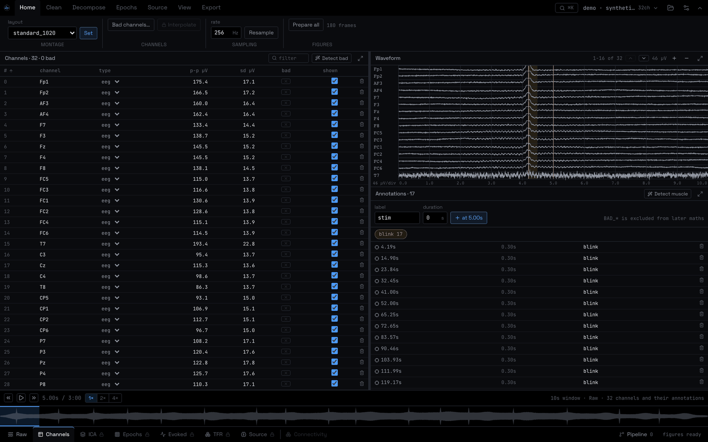

The **Channels** workspace is a sortable table with peak-to-peak and standard
deviation in µV per channel, so a dead electrode is a number and not a hunch.
Rename inline, retype, filter, drop, mark bad. **Detect bad** runs
`find_bad_channels_lof` and *merges* with your manual list rather than replacing
it.

Next to it, annotations: create one at the cursor, drag it, delete it, click to
seek. `BAD_*` spans are called out in alert colour because that prefix is not
cosmetic, MNE genuinely excludes those spans from filtering, ICA and epoching.

### 4. Decompose it

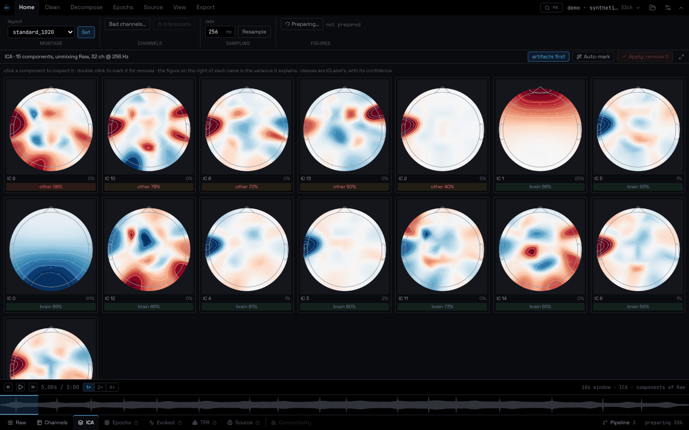

Fit ICA, then hit **Classify**. `mne-icalabel` puts a class and a confidence on
every component, artifacts sort to the front, and **Auto-mark** selects
everything classified as an artifact at ≥80% so you review three components
instead of eyeballing twenty.

### 5. Get to the interesting half

Epochs → evoked → time-frequency. If the recording has no events, epochs come
from a fixed grid, so a resting-state session still reaches an evoked response.

<table>
<tr>
<td width="50%">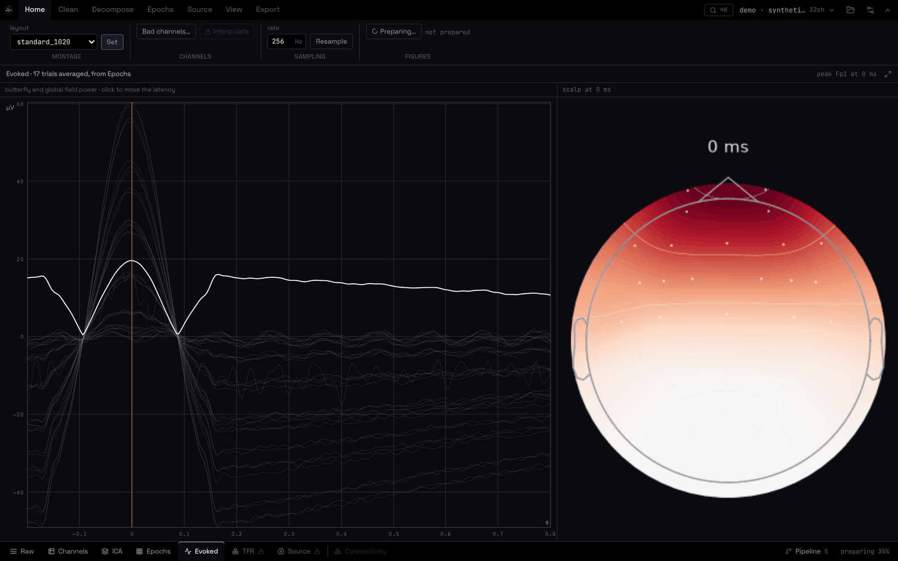</td>
<td width="50%">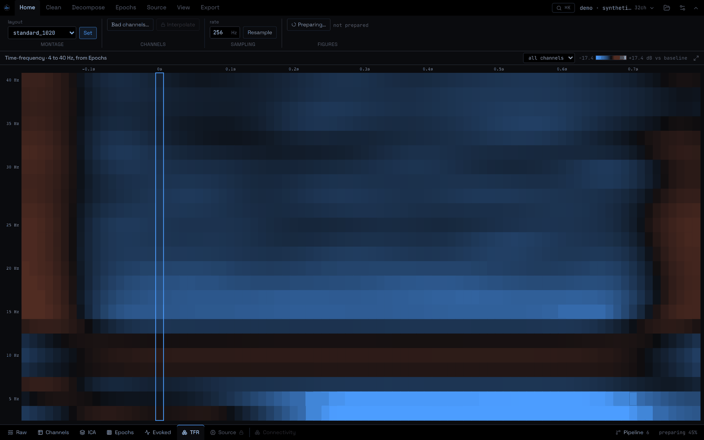</td>
</tr>
<tr>
<td>Butterfly with global field power, and a topography at whatever latency you click.</td>
<td>Morlet power, baseline-corrected in dB, diverging around zero.</td>
</tr>
</table>

### 6. Take it with you

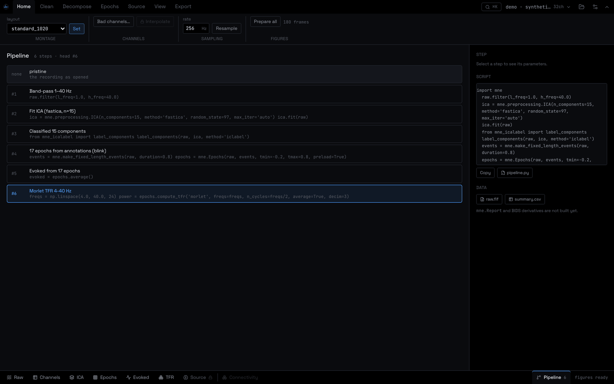

Every step you took, with the MNE call that made it. Click any step to fork from
it, both branches survive. Export `pipeline.py` and the script is what you did,
not an approximation of it.

---

## How it fits together

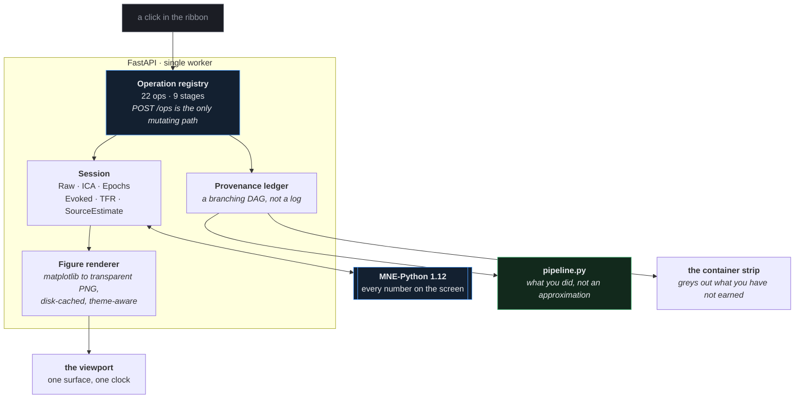

Three ideas carry the whole design.

**One operation, one MNE call, one registry entry.** Adding a capability means
adding an `Operation`: an id, a stage, the container kinds it consumes and
produces, a Pydantic parameter model, and the capability tokens it requires.
The palette entry, the generated form, the gating, the ledger row and the line
in the exported script all fall out of that one declaration. There is exactly
one endpoint, `POST /ops`. A step that does not go through it does not exist in
the ledger, and so does not exist in your script.

**The ledger is a DAG, not a log.** Re-running from an earlier step forks rather
than overwrites.

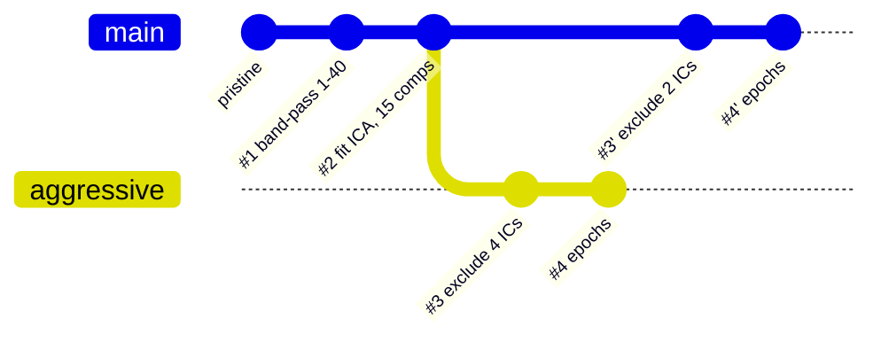

Both branches survive, either is one click away, and `pipeline.py` is generated
from whichever path you are standing on.

**The container graph decides what is reachable.** Each operation declares the
capability tokens it needs, and the bottom strip greys out what you have not
earned yet.

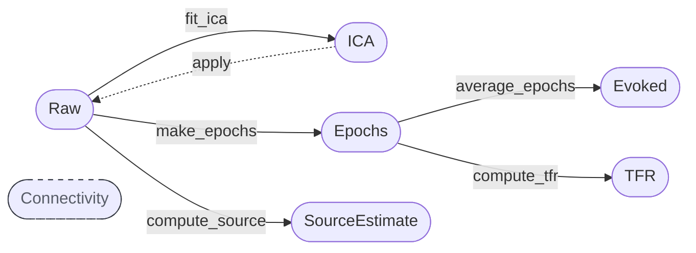

`Connectivity` is drawn as a ghost because it is not built. Showing the shape of
the gap is more honest than hiding it.

---

## Some of the maths

Not a course, just the five places where knowing the formula changes how you
read the screen.

**Band-pass.** `raw.filter()` is a zero-phase FIR applied forwards and
backwards, so there is no phase distortion, but the transition band is not free.
The default transition width is $\min(\max(0.25 \cdot l_{freq}, 2), l_{freq})$
on the low edge, and the filter length that follows is why a 0.1 Hz high-pass on
a short recording warns you.

**Average reference.** Every EEG measurement is a difference, and the reference
is a choice you are making whether or not you think about it:

$$V_i^{\text{avg}} = V_i - \frac{1}{N}\sum_{j=1}^{N} V_j$$

Bad channels are excluded from that mean, which is why the app makes you mark
them before it lets you re-reference.

**ICA.** The recording is modelled as an instantaneous linear mix of $N$ sources:

$$\mathbf{x}(t) = \mathbf{A}\,\mathbf{s}(t) \qquad \hat{\mathbf{s}}(t) = \mathbf{W}\,\mathbf{x}(t)$$

Each component card shows a column of $\mathbf{A}$, which is why it looks like a
scalp map: it is how strongly that one source projects to each electrode.
Excluding component $k$ means unmixing, zeroing that source, and mixing back:
$\tilde{\mathbf{x}} = \mathbf{A}\,\mathrm{diag}(\mathbf{m})\,\mathbf{W}\mathbf{x}$
with $m_k = 0$. Every channel survives, minus that source's contribution to it,
which is why removing a component is not the same as dropping a channel, and why
the variance percentage on each card is the number to look at.

**Time-frequency.** Morlet power, then dB against the pre-event baseline:

$$P(f,t) = \left| (x * \psi_f)(t) \right|^2 \qquad
P_{\text{dB}}(f,t) = 10 \log_{10} \frac{P(f,t)}{\overline{P_{\text{baseline}}}(f)}$$

The ratio is what makes the plot readable. Raw power is dominated by the $1/f$
slope and a spectrogram of it shows you nothing but a bright bottom edge, which
is exactly what the diverging ramp and the zero-centred colour bar are for.

**Source localisation.** The inverse problem is underdetermined (fsaverage `ico-5` is
20,484 candidate dipoles; a 32-channel cap gives 32 measurements), so it is solved as a regularised minimum norm:

$$\hat{\mathbf{s}} = \arg\min_{\mathbf{s}} \left\lVert \mathbf{x} - \mathbf{G}\mathbf{s} \right\rVert^2 + \lambda^2 \left\lVert \mathbf{s} \right\rVert^2$$

with $\lambda^2 = 1/\mathrm{SNR}^2 = 1/9$, and dSPM noise-normalises the result.
Two very different source configurations can produce nearly the same scalp map,
so read the brain view as *one* plausible answer, not the answer.

---

## What is in the box

| | |
|---|---|
| **Operations** | 22 across 9 stages, every one a registry entry with a generated form |
| **Containers** | Raw · Channels · ICA · Epochs · Evoked · TFR · SourceEstimate |
| **Formats in** | EDF, BDF, GDF, FIF, BrainVision, EEGLAB, CNT, EGI, Persyst, SNIRF, CTF, KIT, EyeLink, Curry |
| **Formats out** | `pipeline.py`, `raw.fif`, `epochs.fif`, `summary.csv` |
| **Tests** | 101 backend · 92 frontend unit and component · 18 browser scenarios (×2 viewports) |
| **Themes** | dark and light, with figures re-rendered in the palette rather than inverted |
| **Phone** | yes, actually |

<details>
<summary>The 22 operations, by stage</summary>

| Stage | Operations |
|---|---|
| Ingest & assembly | `resample` |
| Montage & channels | `set_montage`, `set_bads`, `set_reference`, `drop_channels`, `rename_channels`, `reorder_channels`, `set_channel_types` |
| Filter & repair | `filter`, `notch`, `detect_bad_channels`, `interpolate_bads` |
| Artifact ID | `annotate_amplitude`, `annotate_muscle`, `set_annotations` |
| Decompose | `fit_ica`, `label_ica`, `exclude_ica_by_label` |
| Epoching | `make_epochs` |
| Evoked | `average_epochs` |
| Time-frequency | `compute_tfr` |
| Source | `compute_source` |

</details>

---

## Extending it

Any function becomes a first-class operation. The form comes from the type
hints, the gating from the capability tokens, and the line in `pipeline.py` from
the template.

```python
import sema
import mne

@sema.operation(label="Detrend", stage="Filter & repair")
def detrend(raw, order: int = 1):
    """Remove a polynomial trend from every channel."""
    raw.apply_function(lambda x: mne.filter.detrend(x, order), verbose="ERROR")
```

`order` becomes a numeric field defaulting to 1. The step lands in the ledger
and in the exported script like any built-in.

This is the door, and it should be said plainly that nobody has walked through
it yet. EEGLAB's real advantage is a hundred community plugins; an extension
surface with no ecosystem is a promise, not a feature.

---

## Against EEGLAB

EEGLAB is the most used graphical EEG tool in research, so it is the honest
benchmark. [`docs/EEGLAB_PARITY.md`](docs/EEGLAB_PARITY.md) is the full ledger,
including the uncomfortable half.

**Matched:** channel locations editor, event table, `clean_rawdata`'s
channel half, `pop_interp`, `pop_runica`, **ICLabel**, `pop_epoch`,
`pop_rejepoch`, `pop_erpimage`, `pop_timtopo`, `pop_newtimef`, the scrolling
data viewer, `EEG.history`, and a plugin architecture.

**Better here:** no MATLAB licence; provenance you can branch and check out
rather than a flat transcript; precomputed figures linked to the timeline, so
sweeping a topography across a whole recording has no lag; figures drawn in the
app's own ink; one clock across every container; and it works on a phone.

**Still missing, in the order worth building:** ASR (the other half of
`clean_rawdata`), dipole fitting, connectivity, and then **STUDY-style
multi-subject group analysis**, which is the single biggest gap and is a change
to the session model rather than one more operation. Also: breadth inside stages
that exist (one ICA method, one TFR method, no filter design controls), and BIDS
read/write.

---

## On a phone

<div align="center">
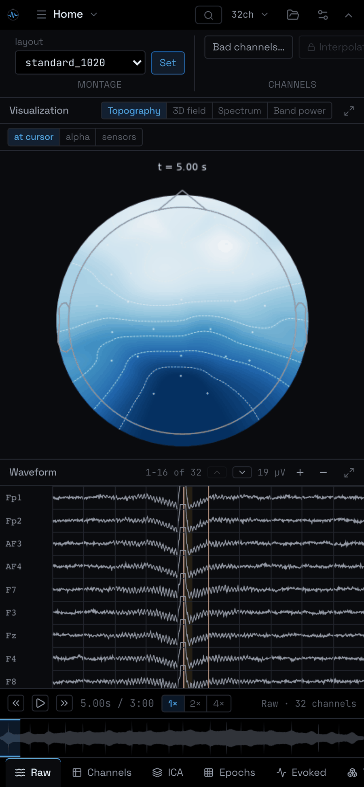
</div>

The ribbon collapses, the container strip scrolls, and the viewport shows one
pane at a time. Not a demo: the browser suite runs every scenario at 390px as
well as 1440px, because a layout that only works on the machine it was built on
is not finished.

---

## Working on it

```bash
./scripts/check.sh          # backend tests, typecheck, lint, frontend tests
./scripts/check.sh fast     # skip the slow source-localisation tests
./scripts/check.sh e2e      # plus Playwright against real servers
node scripts/shots.mjs      # regenerate the screenshots in this README
```

The browser suite reuses running servers, so `./dev.sh` and `check.sh e2e` share
a stack. CI runs the same script (`.github/workflows/check.yml`), under `xvfb`
because PyVista renders the 3D views offscreen and a headless runner has no GL
context of its own.

```
backend/
  app/core/operations/   the registry: one file per stage, one class per MNE call
  app/core/render.py     matplotlib to transparent PNG, disk-cached
  app/core/precompute.py the whole-recording figure pass
  app/services/          session_manager.py · ledger.py · persistence.py · jobs.py
  app/api/               thin routers; POST /ops is the only mutating path
  sema/                the pip package: launch(raw), the CLI
frontend/
  src/components/shell/  Ribbon · ContainerStrip · TimeBar · Workspace
  src/components/panels/ Waveform · ChannelsTable · Annotations · ICA
  src/components/cards/  VisualsCard · EpochsCard · EvokedCard · TFRCard · SourceCard
  src/lib/plot/          the canvas substrate: LinePlot, Heatmap, scales, paint
  src/lib/figures.ts     the client half of the precomputed figure cache
  src/store/             zustand slices; the cursor is the spine
docs/
  ARCHITECTURE.md        how the pieces fit
  EEGLAB_PARITY.md       the honest comparison
  MNE_CAPABILITY_MAP.md  what MNE can do, and how much of it is wired up
  COMMANDS.md            keyboard reference
```

**One thing to know before changing the backend:** sessions live in an
in-process dict, so it runs single-worker on purpose. A second worker would
serve requests from a process that does not hold the session. Scale the box, not
the worker count.

---

## Credits and licence

Everything numerical is [MNE-Python](https://mne.tools/) (BSD-3). Component
classification is [`mne-icalabel`](https://mne.tools/mne-icalabel/). The
inflated brain is FreeSurfer's `fsaverage`, fetched on first use.

Sema is MIT. See [LICENSE](LICENSE).
